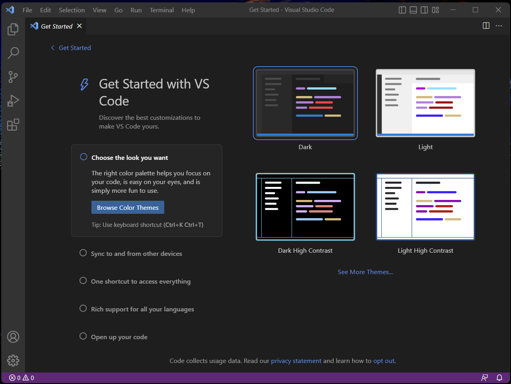
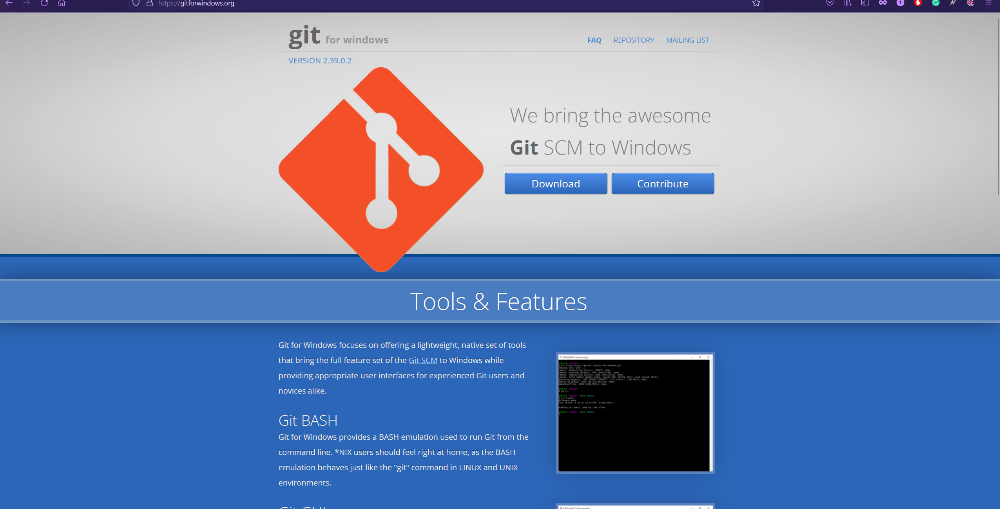
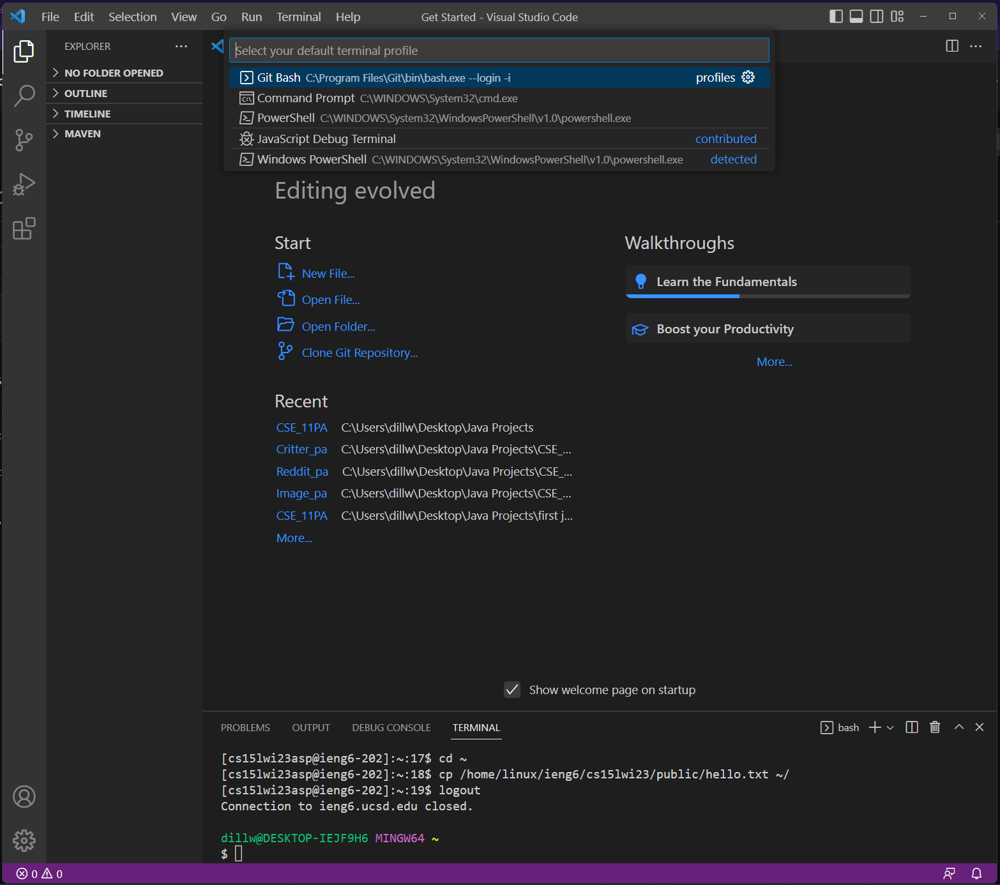
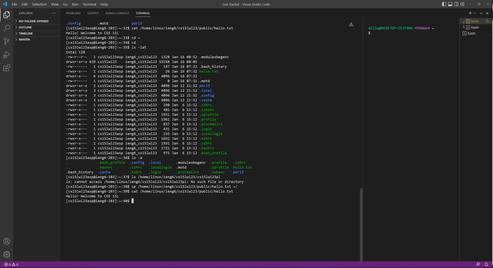

# Lab Report 1
---
# Remote Access
In order to have remote access to CSE 15L server, there are three major steps that need to be taken.
1. Installing VScode.
VScode is a very convenient programming tool. It is also required to connect to the remote server.
Go to [VScode](https://code.visualstudio.com/download), download, and install VScode for you computer.

Then, install [Git](https://gitforwindows.org/) for windows.

Now in VScode, press "control", "shift", and "p" to open the search bar.
In search bar, type "Set Default Profile".
Select git bash.

2. Remotely Connecting.
Go on [Your Account](https://sdacs.ucsd.edu/~icc/index.php), and submit query through account lookup.
Under additional account, write down the account name and click it to reset the password following the instructions.
Then, in VScode, open a command prompt with Git bash. 
Type in `ssh cs15lwi23zz@ieng6.ucsd.edu`, and replace the "zz" with the letter for your account.Type in your password afterward.
Type `yes` after the system asked `Are you sure you want to continue connecting (yes/no/[fingerprint])?`

3. Running Some Commands.
Running command on the remote server is interesting.
* Command `cd` changes the directory to the intended location.
* Command `ls` gives lists of files in the directory.
* Command `cp` copies the indicated file.
* Command `cat` prints out the content of the file in the terminal.

