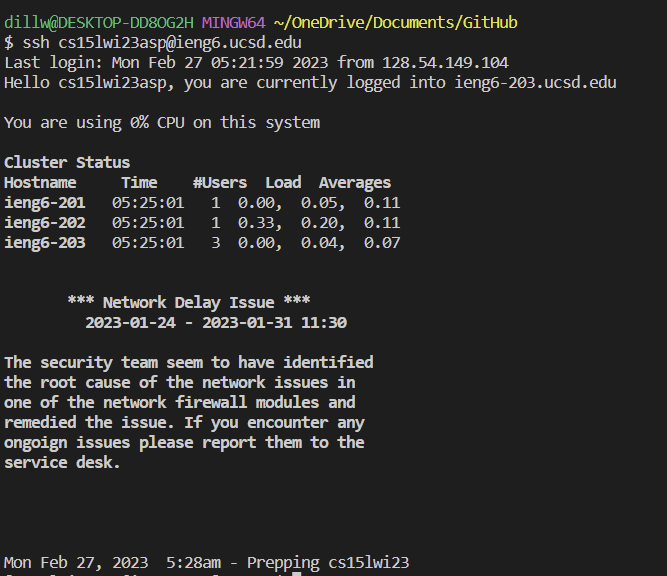
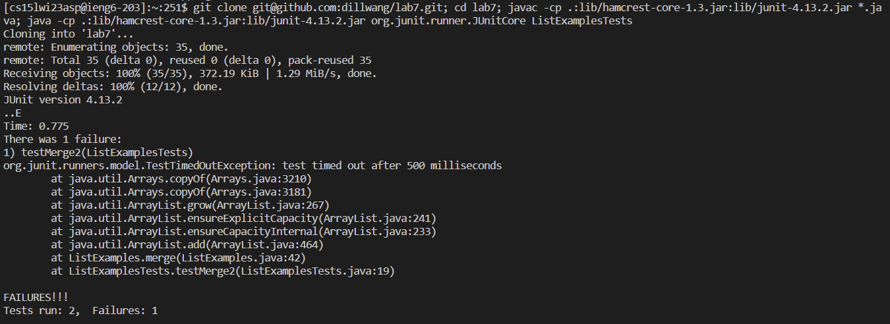
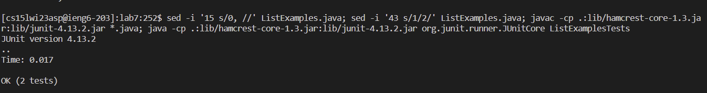
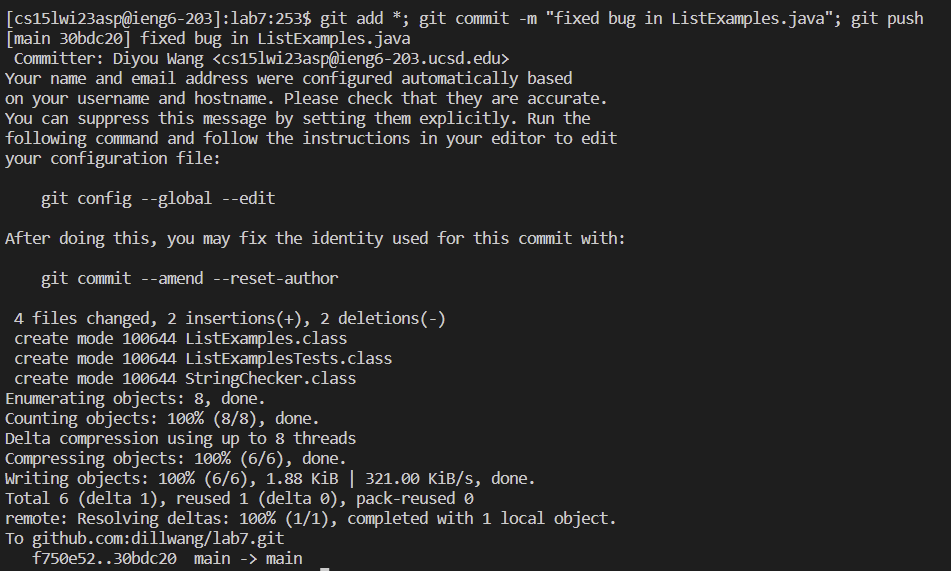

# Lab Report 4
# "Done Quick" Competition
---
# Step 4

In this step, I simply press `<up><enter>` because the command was stored in my git bash history. So it should show up after i pressed `<up>` once. The command stored in the history is `ssh cs15lwi23asp@ieng6.ucsd.edu`. The first part `ssh` is the command used to login to remote server in git bash. The seocond part is my account.

# Step 5-6

After I logged into the server, I pressed `<up><up><up><up><enter>`. The command was also stored in my history 4 commands ago. The command stored is `git clone git@github.com:dillwang/lab7.git; cd lab7; javac -cp .:lib/hamcrest-core-1.3.jar:lib/junit-4.13.2.jar *.java; java -cp .:lib/hamcrest-core-1.3.jar:lib/junit-4.13.2.jar org.junit.runner.JUnitCore ListExamplesTests` As you can see the command line is quite long, so I will try to break this command down. Basically this entire code line has 4 commands chained together in git bash using the `;`. Chaining command is a feature in git bash as long as you put `; ` between them. 
* The first command `git clone git@github.com:dillwang/lab7.git` clones the repository from github to the server. Important thing to note here is that the url in this code is for ssh instead of the typical `https` link. This is because after adding the key to github from this server, the command `git push` later will not ask the user to put in username and password. This will save a lot of time.
* The second command `cd lab7` just change the directory into the new lab7 folder that we just cloned from github.
* The third command `javac -cp .:lib/hamcrest-core-1.3.jar:lib/junit-4.13.2.jar *.java` is a command that compiles all java files in current directory using Junit testing rules. This is required for Junit testing.
* The forth command `java -cp .:lib/hamcrest-core-1.3.jar:lib/junit-4.13.2.jar org.junit.runner.JUnitCore ListExamplesTests` runs the `ListExamplesTests` in Junit Testing.

These commands together should clone the repository, change directory into the new repository, complies all java files in Junit styles, and runs Junit Testing on the `ListExamplesTests` file.

# Step 7-8

For step 7 and step 8, I also pressed `<up><up><up><up><enter>`. The command was also stored in my history 4 commands ago(because we put more command in from last step). The command stored is `sed -i '43 s/1/2/' ListExamples.java; javac -cp .:lib/hamcrest-core-1.3.jar:lib/junit-4.13.2.jar *.java; java -cp .:lib/hamcrest-core-1.3.jar:lib/junit-4.13.2.jar org.junit.runner.JUnitCore ListExamplesTests`. This entire code line here has 3 commands chained together in git bash using the `;`. Chaining command is a feature in git bash as long as you put `; ` between them. 
* The first command `sed -i '43 s/1/2/' ListExamples.java` uses the `sed` function in git bash. The sed command is a powerful text editor. `-i` indicates that this command line will directly modify the file `ListExamples.java`. `43` specifies the line number where the substitution should be performed. `s` indicates the substitution command. `1` is the regular expression to be matched and replaced. `2` is the replacement string that replaces the matched pattern. This command goes to line `43` in file `ListExamples.java`, finds the `1`, and replace it with `2`. This will fix the bug on the method `merge` inside the class `ListExamples` because the bug happened when the while loop was used on `list2` and was updated on `index1`.
* The second command `javac -cp .:lib/hamcrest-core-1.3.jar:lib/junit-4.13.2.jar *.java` is a command that compiles all java files in current directory using Junit testing rules. This is required for Junit testing.
* The third command `java -cp .:lib/hamcrest-core-1.3.jar:lib/junit-4.13.2.jar org.junit.runner.JUnitCore ListExamplesTests` runs the `ListExamplesTests` in Junit Testing.

# Step 9

For step 9, I also pressed `<up><up><up><up><enter>`. The command was also stored in my history 4 commands ago(because we put more command in from last step). The command stored is `git add *; git commit -m "fixed bug in ListExamples.java"; git push`. This entire code line here has 3 commands chained together in git bash using the `;`. Chaining command is a feature in git bash as long as you put `; ` between them. 
* The first command `git add *` adds a change in the working directory to the staging area. It tells Git that i want to add all the files in current working directory to my next commit.
* The second command `git commit -m "fixed bug in ListExamples.java"` take all of the changes that have been made locally in the file ListExamples.java and push it to a remote repository. The `-m` here allows you to add a message when committing the changes.
* The third command `git push` simply uploads local repository content to a remote repository.
Now that everything is done. This is the fastest method i can optimize to so far. Let me know if you have any faster methods recommendation!

