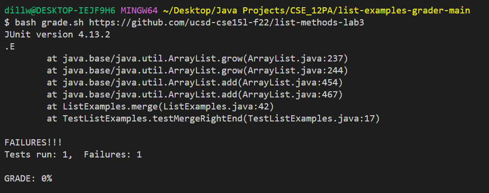
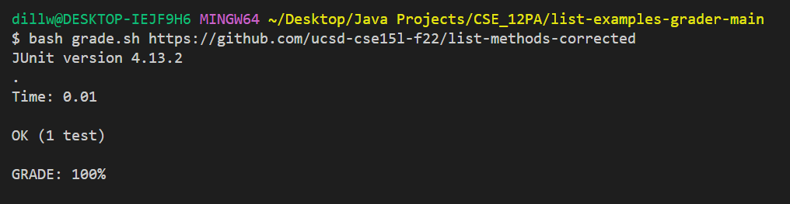
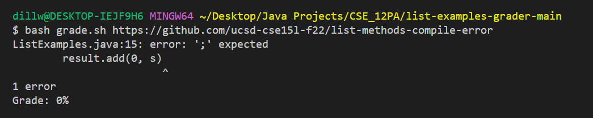
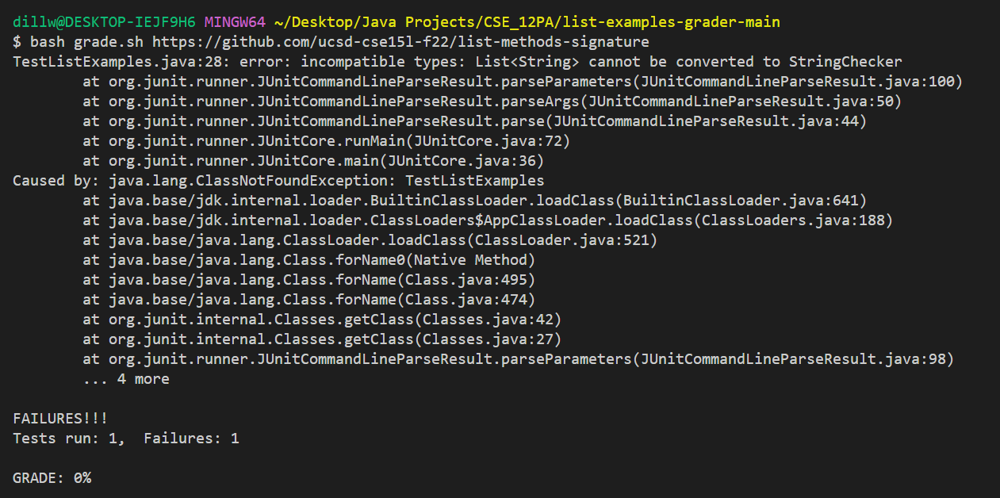
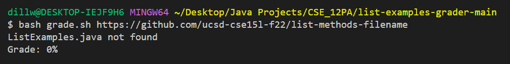
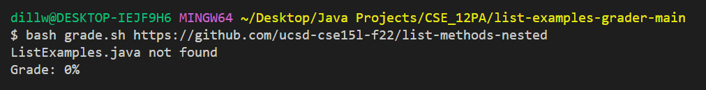
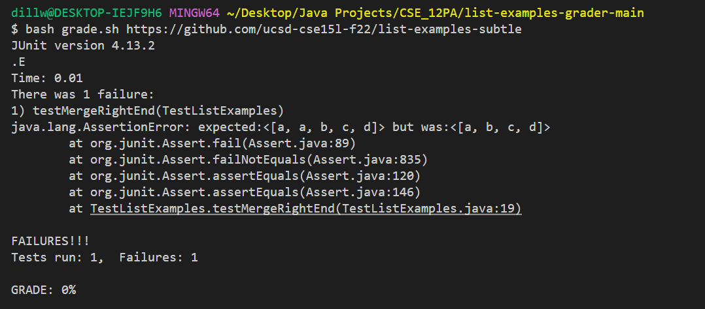

# Lab Report 5
# Creating a grading script
---
For lab 6, me and my lab partner created a grading script that takes in a url of student submission and runs some tests on it to determine the student's grade and the validity of the submission.
There is our code for the file `grade.sh`.
```
CPATH='.;../lib/hamcrest-core-1.3.jar;../lib/junit-4.13.2.jar'

rm -rf student-submission
git clone -q $1 student-submission
if [[ ! -f student-submission/ListExamples.java ]]
then
    echo "ListExamples.java not found"
    grade=0 
    echo "Grade: $grade"
    exit 1
fi
cp TestListExamples.java student-submission
cd student-submission
javac ListExamples.java
if [[ $? != 0 ]]
then
    grade=0 
    echo "Grade: $grade"
    exit 1
else 
    javac -cp $CPATH TestListExamples.java
    java -cp $CPATH org.junit.runner.JUnitCore TestListExamples > results.txt
    numTests=`grep -oE "Tests run: [0-9]+," results.txt | grep -oE "[0-9]+"`
    numFailures=`grep -oE "Failures: [0-9]+" results.txt | grep -oE "[0-9]+"`
    if [[ $numTests -eq 0 ]]
    then
        grade=0
    else
        let grade=($numTests-$numFailures)*100/$numTests
    fi

    if grep -qE "OK \([0-9]+ test[s]?\)" results.txt
    then
        grade=100
    fi
fi
cat results.txt
echo "GRADE: $grade%"
```
In short, this grading script first resets and set up all the files that is needed for this by `rm -rf student-submission` and `git clone -q $1 student-submission`. After that, it checks if the `ListExmaples.java` file exist in the directory. It will return 0 grade and a message saying file not found if the program cannot find `ListExamples.java`. If it does find the `ListExamples.java`, it will copy the test file `TestListExample.java` into this directory and start testing. The following commands handles the grading logistic. It handles situations like compiler errors, grade between 0% and 100%, 0% grade, and 100% grade. 
# Tests
* Lab 3 starter code:



There are bugs in the methods so the code should get no points.

* A Corrected implementation:



This implementation is correct so it scores full mark.

* Syntax error in the code: 



This implementation has syntax error so it will not compile properly.

* Wrong signature



This implementation has wrong signature for filter method, so the the testing should detects that.

* Wrong filename



This implementation has wrong filename, so it should say file not found.

* Nested file



This submission does not have the file in the correct directory, so it should say file not found.

* Subtle bugs



This implementation has bugs which should be detected.
